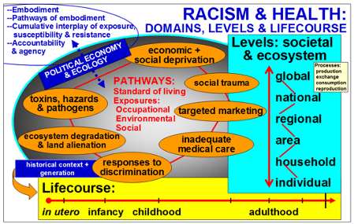
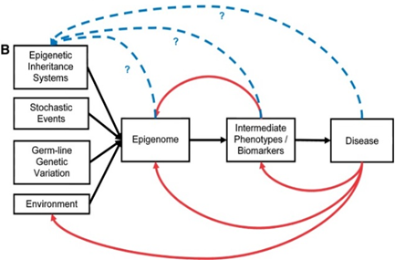

# DNA methylation & adversity: pathways from exposures to health inequities

## Project Narrative 

Our study will test novel hypotheses about how one type of epigenetic
modification, DNA methylation (DNAm), varies with exposure to racial
discrimination, economic hardship, and air pollution, and how these kinds of
epigenetic changes may contribute to racial/ethnic and economic disparities in
cardiometabolic disease risk and accelerated aging (defined as epigenetic age >
chronological age). To strengthen the credibility of our findings, we test our
hypotheses in two independent population-based studies, using: (1) the My Body,
My Story (MBMS) study (R01 AG027122), which contains rich exposure and
cardiometabolic health outcome data based on a random sample of 1005 US-born
non-Hispanic black (n = 504) and non-Hispanic white (n = 501) adults, aged 35
to 64 years, recruited from four community health centers in Boston, MA
(2008-2010), and for which we will newly analyze DNA methylation based on the
participants’ stored blood spots; and (2) newly available analogous data from a
subset of Wave 5 (2010-2012) participants of the Multi-Ethnic Study of
Atherosclerosis (MESA) (N = 1264, age 55-94; 582 non-Hispanic white, 270
non-Hispanic black, 404 Hispanic, from Baltimore, MD, Forsyth County, NC, NYC,
NY, and St. Paul, MN). The proposed study accordingly will address the
objective of PAR-16-355 to “expand approaches for understanding epigenetic
mechanisms by which social factors lead to biological changes that affect
health disparities.”

## Specific Aims

Aim 1: Conduct novel analyses to identify variation in DNA methylation (DNAm)
associated with: (1) Aim 1.1: exposure to racial discrimination, economic
hardship, and air pollution; and (2) Aim 1.2: measured cardiometabolic outcomes
(blood pressure, fasting insulin, Type 2 diabetes, Framingham Cardiovascular
Disease 10-year risk score, metabolic syndrome); plus (3) Aim 1.3: For
DNAm-health outcome associations observed in Aim 1.2, use MR-Base (a database
and analytical platform for Mendelian randomization being developed by the MRC
Integrative Epidemiology Unit at the University of Bristol) to strengthen
causal inference about the direction of the associations (e.g., methylation
causes vs. is due to disease); discovery analyses: My Body My Story study data;
replication analyses: Multi-Ethnic Study of Atherosclerosis study data.

Aim 2: Assess the relationships between both the Aim 1 study exposures and
health outcomes with accelerated aging (epigenetic age > chronological age), as
identified by three newly identified DNAm “clocks” (Horvath, Hannum, and DNAm
PhenoAge); discovery: MBMS; replication: MESA. Epigenetic “clocks” measure DNAm
age and are comprised of specified sets of DNAm sites. These clocks “tick” in
all cells and their descendants across the lifecourse and provide a “molecular
estimator” of an organism’s biological age. To ensure robust test of our
hypotheses, we will use 3 different validated “clocks”: the Horvath and Hannum
“clocks,” both created in 2013, and the 2nd generation DNAm PhenoAge “clock,”
developed in 2018.

Aim 3: Analyze if the methylation sites and “clocks” associated with both the
study exposures and health outcomes mediate these exposure-outcomes
associations, thereby contributing to health inequities.
